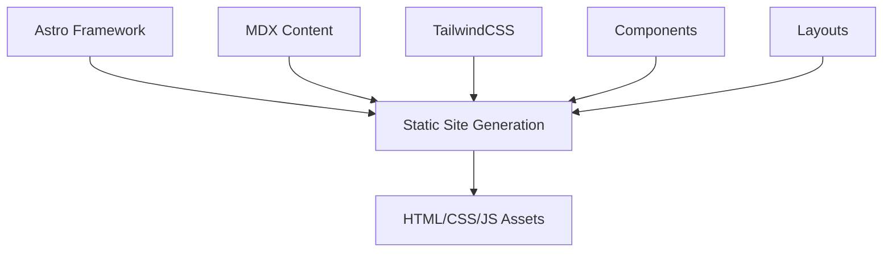

# System Patterns

## Architecture Overview

The Lone Yeti website follows a static site generation approach using Astro as the core framework. The architecture is designed to be simple, maintainable, and performant.

## Component Structure

The site uses a component-based architecture with clear separation of concerns:

1. **Layouts**: Define the overall page structure and shared elements

   - `Layout.astro`: Base layout with HTML structure
   - `PostLayout.astro`: Specialized layout for blog posts with metadata

2. **Components**: Reusable UI elements

   - `Nav.astro`: Navigation component
   - `Welcome.astro`: Homepage welcome component (currently using Astro defaults)

3. **Pages**: Represent routes in the application
   - `index.astro`: Homepage
   - `/blog/*.mdx`: Blog post content

## Content Management

The site uses Astro's file-based routing system and MDX for content:

1. **Blog Posts**:

   - Written in MDX format
   - Located in `/src/pages/blog/`
   - Use front matter for metadata
   - Rendered using `PostLayout.astro`

2. **Content Properties**:
   - Title
   - Publication date
   - Update date (optional)
   - Description
   - Tags
   - Hero image (optional)

## Design Patterns

1. **Responsive Design**: The site is built to be fully responsive across all device sizes

2. **Typography-Focused**: Uses TailwindCSS Typography plugin for rich text styling

3. **Color Theming**:

   - Primary color: Blue (`#1b6bf2`)
   - Accent color: Orange (`#ff6b00`)
   - Supports dark mode via `darkMode: "class"` in Tailwind config

4. **Component Composition**: Components are composed to build pages rather than having monolithic page structures

## Routing

The site uses Astro's file-based routing:

1. `/`: Homepage
2. `/blog`: Blog listing page
3. `/blog/[slug]`: Individual blog posts
4. External links to products (Snowgoose, Novelrunner)

## Performance Considerations

1. **Static Generation**: Pages are pre-rendered at build time
2. **Asset Optimization**: Images and SVGs are optimized
3. **CSS Optimization**: TailwindCSS for minimal CSS footprint
4. **Minimal JavaScript**: Leveraging Astro's partial hydration model

## Future Architecture Considerations

1. **Image Management**: May need a more robust image optimization solution
2. **Search Functionality**: Consider adding search for blog content
3. **Comments System**: Potentially add commenting capabilities
4. **Analytics Integration**: Add privacy-friendly analytics
